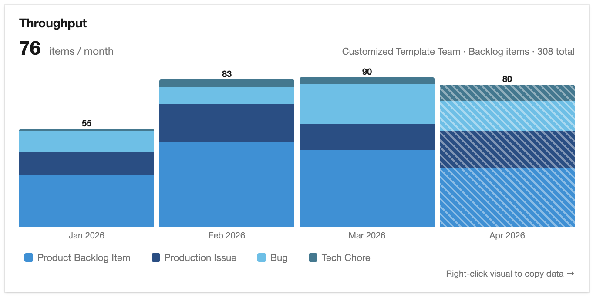
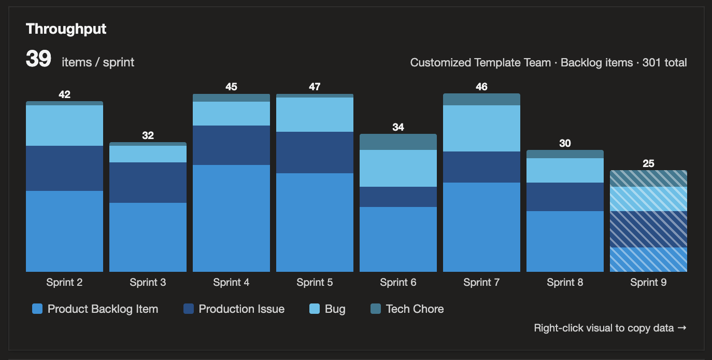

# Throughput

Azure DevOps dashboard widget that shows your team's completion trend — items moved to Done per sprint, month, or quarter. Items are grouped into buckets by closed date, so the visual updates automatically as work completes — no need to set iteration paths or tags.



- **Sprint, Month, or Quarter intervals** — bucket completed work by your team's actual sprints, by calendar month, or by calendar quarter.
- **Any backlog level** — Epics, Features, Backlog Items, or Tasks, plus custom backlog levels and work item types.
- **Stacked by work item type** — bars are colored from a curated palette designed for at-a-glance comparison, with a legend below the visual.
- **Click the legend to filter by type** — hide a type to compare ratios over time, or isolate one type's trend.
- **Right-click to copy items as TSV** — every visible work item, paste-ready for Excel or Google Sheets, with 15 columns including all three lifecycle dates.
- **Closed date bucketing** — work items are shown where they actually closed, not where their iteration path was set, so they are always in the correct time bucket.



[](https://sonarcloud.io/summary/new_code?id=agileviz_throughput)

## Install

Install from the Azure DevOps Marketplace:

**[marketplace.visualstudio.com — AgileViz.Throughput ↗](https://marketplace.visualstudio.com/items?itemName=AgileViz.Throughput)**

After installation, add the widget to any team dashboard and configure the team, interval (Sprint / Month / Quarter), and backlog level.

## Documentation and support

Full documentation, configuration guide, and screenshots:
**[agileviz.com/plugins/throughput/ ↗](https://agileviz.com/plugins/throughput/)**

For bugs or feature requests, [open a GitHub issue](https://github.com/agileviz/throughput/issues) using the appropriate template.

## About this source

This repository contains the source for the Throughput VSIX published to the Marketplace by AgileViz, LLC. It's open source — MIT licensed — so customers and contributors can audit, fork, or contribute.

A few notes worth knowing if you're reading or contributing:

- The widget and configuration pane are **pure TypeScript + DOM manipulation** — no React, no chart library. The stacked bar chart is built from HTML `<div>` flex containers with percentage widths. This pattern is shared across AgileViz plugins for tiny bundle sizes and zero framework lock-in inside the Azure DevOps iframe.
- Styling uses SCSS variables from `azure-devops-ui/Core/core.scss` so light/dark mode tracks the Azure DevOps theme automatically — don't reach for `@media (prefers-color-scheme: dark)`, which follows the OS rather than ADO.
- Pure helpers live under [`src/Library/`](src/Library/) and are split for testability without the SDK:
  - `intervalWindows.ts` — date math for Sprint / Month / Quarter windows
  - `throughputData.ts` — WIQL builder, bucketing, color assignment, and the orchestrator that calls the ADO API
  - `throughputView.ts` — pure transforms over an already-fetched `ThroughputResult` (filter / mean / TSV export)
  - `widgetSettings.ts` — shared settings interface (imported by both Widget and Config bundles)
- The `azure-devops-extension-sdk` and `azure-devops-extension-api/*` modules are AMD-only and crash under Jest's Node runtime. `jest.config.js` redirects them via `moduleNameMapper` to an empty stub at `src/Library/__mocks__/ado-sdk-stub.ts`. Pure helpers don't invoke the SDK at module load, so the stub is enough — if you add a test that calls into the SDK, mock it explicitly per-test rather than expanding the stub.
- Build output (`dist/`, `*.vsix`) and `node_modules/` are gitignored. The shipped VSIX is produced by `npm run build`.

The main source entry points live under [`src/Contribs/Widget/`](src/Contribs/Widget/) (the rendered widget) and [`src/Contribs/Config/`](src/Contribs/Config/) (the configuration pane).

## Building from source

```bash
npm install              # first-time install
npm test                 # Jest with coverage (74 tests, coverage thresholds enforced in jest.config.js)
npm run lint             # ESLint on src/**/*.{ts,tsx}
npm run build            # clean + production webpack build → .vsix at repo root
```

Testing changes against a real Azure DevOps organization requires installing a dev VSIX side-by-side with the production extension. The dev manifest has a different `id` and a `baseUri` pointing at `https://localhost:3000`, so a local webpack-dev-server can serve the bundle to a dev ADO org without rebuilding the VSIX between changes:

```bash
npm run build:dev        # produce a dev VSIX (separate id from production)
npm run serve            # webpack-dev-server on https://localhost:3000
```

Install the dev VSIX into an ADO org you control, then iterate against `npm run serve`.

## License, contributing, security

- **[LICENSE](LICENSE)** — MIT, with a Trademark Notice for "AgileViz" and AgileViz product names.
- **[CONTRIBUTING.md](CONTRIBUTING.md)** — contribution guidelines.
- **[CODE_OF_CONDUCT.md](CODE_OF_CONDUCT.md)** — Contributor Covenant v2.1.
- **[SECURITY.md](SECURITY.md)** — responsible disclosure process. Source-code reports route through GitHub Security Advisories; hosted-service reports go through the bug bounty at [agileviz.com/security/](https://agileviz.com/security/).

---

Throughput is created by **AgileViz**. The plugins each do one thing well — simplicity is a feature, not an oversight.
