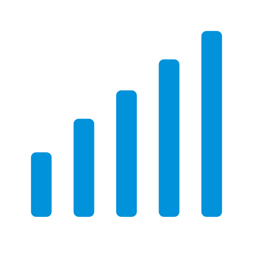
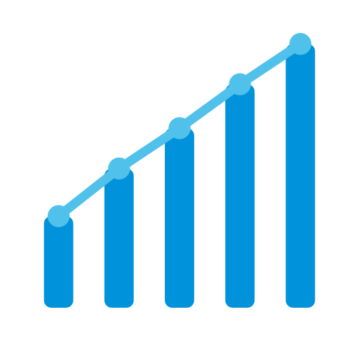
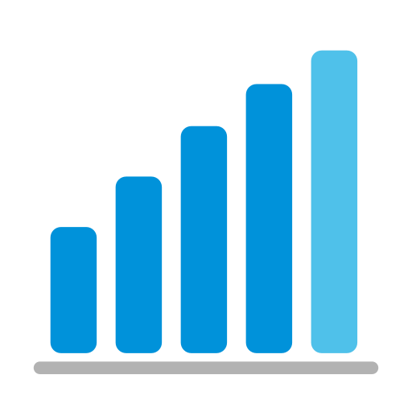
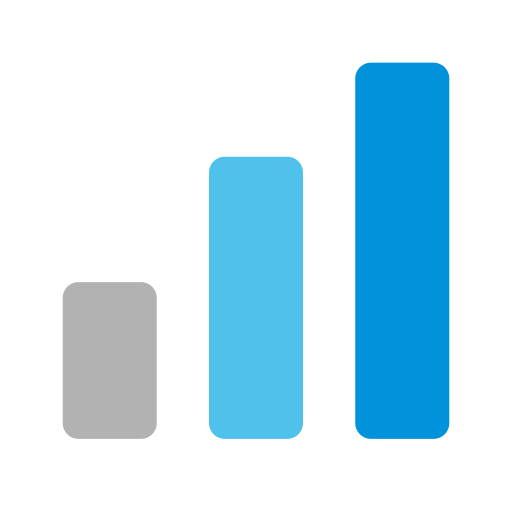

# Throughput — icon options

Five candidate icons for the Throughput plugin (ADO Marketplace). All are drawn on the same `viewBox="0 0 196 196"` as Visual Rollup's source SVG so they sit in the same visual family at marketplace sizes (displayed at 128×128, rendered at 512×512 to survive the browser downscale).

**Brand palette**: `#0092da` (AgileViz logo blue) / `#4FC1EA` (sky accent) / `#b2b2b2` (neutral). **Motif**: vertical bars, ascending heights — to read as "quantity over time" rather than a generic bar chart. **Sibling cue**: rounded-rect bars with rounded corners (`rx ≈ 20% of short axis`), identical canvas, no outer container — matching Visual Rollup's floating-bar style rotated 90°.

Sibling reference (Visual Rollup):

---

## Option 1 — Sibling Stack

Four ascending bars, each clipped into two percentage segments: a sky-blue cap (`#4FC1EA`, ~30%) over a brand-blue base (`#0092da`, ~70%). This is the most direct rhyme with Visual Rollup: same clipPath-per-bar stacking technique, same two-tone rollup language, same "floating pills" style — just rotated from horizontal progress bars into vertical throughput bars. The two-color stack also matches the product semantic ("PBIs + Bugs per interval"). It sacrifices a little simplicity for that extra payload of meaning. Strongest sibling signal.

## Option 2 — Pure Ascend

Five monochrome `#0092da` bars with clear step-up heights. No ornament, no stack. Emphasizes the rise — the throughput signal — and nothing else. Feels like a cousin to Visual Rollup rather than a sibling: same rounded-rect bar language, same minimalist floating composition, but drops the multi-segment stack motif entirely. Sacrifices the "stacked by work-item type" reference; gains the cleanest, most unambiguous read. The safest choice if you want throughput to feel like the "lightweight / fast" plugin relative to Rollup's heavier analytic bar.

## Option 3 — Velocity Trendline

Five brand-blue bars with a sky-blue polyline and node dots connecting their tops. The most "this is a chart" of the five — the trendline + nodes is the universal shorthand for time-series growth, which nails the "quantity over time" brief. Sacrifices a bit of the Rollup family resemblance in exchange for being the most literal throughput signal at a glance. Risk: slightly busier at 128×128 than the others (though still legible in testing).

## Option 4 — Time Axis

Five ascending bars seated on an explicit neutral-gray baseline; the tallest (most-recent) bar is `#4FC1EA` to mark the current interval. The baseline is the only icon in the set that calls out a time axis explicitly, which sharpens the "per sprint/month/quarter" semantic. The last-bar recency highlight is a common chart convention. Sacrifices a little visual simplicity (two extra elements: baseline + accent bar) in exchange for the clearest "over time" read. Family tie to Rollup is moderate — matching bar language, plus a neutral gray element that echoes Rollup's gray segment.

## Option 5 — Progression Three

Three bold ascending bars that progress neutral gray → sky → brand blue. Deliberately a _count sibling_ of Visual Rollup (three elements, just like Rollup's three horizontal bars), and uses saturation as a second axis of "growth" on top of the height rise. The wider bars and empty space give it the strongest presence at 128×128 of any option here. Sacrifices granularity (only three intervals shown, no stacking, no trendline). Best if you want Throughput to feel like a _confident, opinionated_ plugin — a one-glance KPI rather than a detailed chart.

---

## Recommendation

**Ranked pick**

1. **Option 1 — Sibling Stack** (primary recommendation). Best balance of sibling resemblance, brand palette use, and product-accurate semantics (stacked work-item types per interval). If Throughput and Visual Rollup are going to live next to each other in the AgileViz publisher profile, this is the pair that most clearly says "these are two tools from the same platform."
2. **Option 5 — Progression Three**. Best standalone icon — boldest presence at thumbnail size, cleanest read, and the three-count rhymes with Rollup without copying it. Pick this if catalog-scan legibility matters more than semantic precision.
3. **Option 4 — Time Axis**. Best if user research says "users miss that it's time-based" — the baseline is an insurance policy for that signal.
4. **Option 2 — Pure Ascend**. Best if you plan to launch more plugins and want Throughput to anchor the _minimal_ end of the family spectrum (Rollup = complex, Throughput = simple).
5. **Option 3 — Velocity Trendline**. Clearest "chart" read but least family resemblance and the busiest at 128×128. Keep as a fallback if marketing wants maximum "this is a velocity tool" signal.

**Trade-offs worth flagging**

- Option 1 is the most "on-brand for the family," but from 4 ft / in a crowded marketplace catalog, Options 5 and 2 will be easier to distinguish from Rollup at a glance. If users are likely to see both icons side-by-side, Option 1's stacked two-tone bars could get mistaken for Rollup's stacked bars until the eye registers that one is horizontal and the other is vertical.
- Option 3's trendline is the only element in any option with a thin stroke. It survives 128×128 rendering here, but if the marketplace ever downscales further (e.g. 64×64 in a sidebar), it will be the first thing to break.
- Option 4 is the only option using three colors (brand, sky, neutral). It matches Rollup's three-color palette exactly, which could read as _too_ sibling — the only thing distinguishing them at a glance would be bar orientation.
