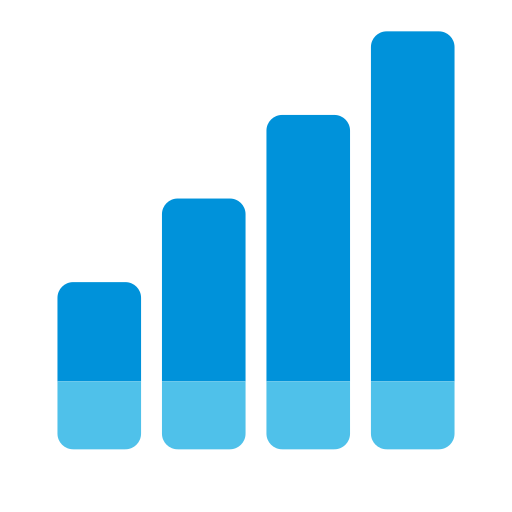
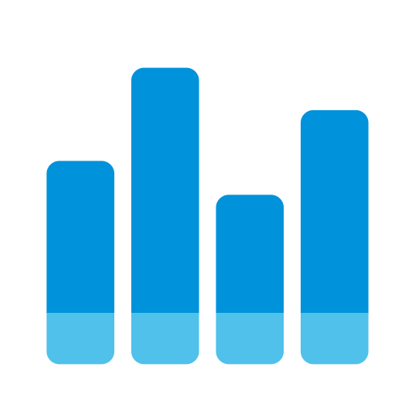
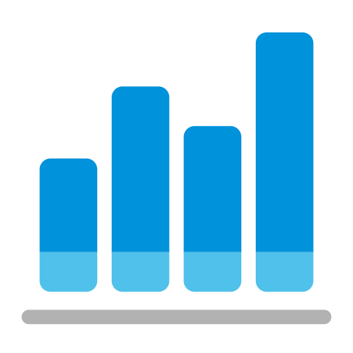
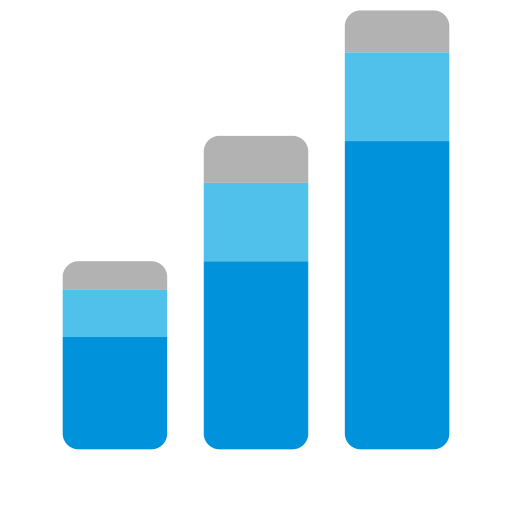

# Throughput icon — design options

Four candidate icons for the AgileViz Throughput plugin. All share Visual
Rollup's 196×196 canvas, `rx=6` rounded corners, and flat-fill aesthetic, so
they read as family. They diverge from Visual Rollup by rotating the bar
motif 90° (vertical columns instead of horizontal pills) and by swapping the
green-dominant palette for AgileViz's brand blue (`#0092da`) with a sky-blue
accent (`#4FC1EA`) — a direct, consistent sibling-not-twin relationship.

Visual Rollup for reference:

---

## Option 1 — Monotonic staircase

Four ascending columns, each with a constant-height sky-blue cap sitting on a
brand-blue body. The constant-height cap tells a specific throughput story:
"a steady sliver of Bugs each sprint, on top of rising PBI throughput." The
monotonic climb reads instantly as "things are improving over time," which is
the marketer-friendly framing. The sacrifice: it's *too* clean. Real
throughput bounces; a perfect staircase risks feeling like stock clip-art
rather than a genuine team signal. Sibling relation: strong — same
stacked-segment language as Visual Rollup, rotated and re-palette'd.

## Option 2 — Honest histogram

Four columns at varying (non-monotonic) heights, each with the same blue body
+ sky cap split. This is what a real throughput chart looks like: one good
sprint, one bad sprint, etc. It reads as "measurement, not marketing," which
matches AgileViz's analytical positioning. The trade-off: without a clear
directional signal, at 32px it might just read as "generic bar chart" rather
than specifically "throughput." Sibling relation: strong — same construction
as Option 1 with just a different height pattern.

## Option 3 — Columns on a baseline axis (recommended)

Four columns with varied heights (trending up but not monotonically), plus a
neutral-gray baseline rule below the bars that explicitly signals a time
axis. The baseline is the key move: it locks in the "quantity per interval"
reading that pure-bars alone can't quite guarantee, and it becomes a subtle
but distinctive feature at a glance. The right-most bar is tallest, giving a
gentle "throughput improving" cue without the clip-art feel of a pure
staircase. The baseline also echoes the neutral-gray segment Visual Rollup
uses, so the palette stays in the same three-color family even though this
icon only uses gray structurally. Sibling relation: strong; also the most
differentiated from Visual Rollup at a glance (the horizontal ground line is
a second distinguishing axis beyond bar orientation).

## Option 4 — Rotated sibling (3 bars, 3 colors)

The most literal sibling: three ascending columns with the same 3-color stack
proportion Visual Rollup uses (dominant color / accent / neutral), just
rotated 90° and reversed in direction (Visual Rollup descends left-to-right;
this ascends left-to-right). Same bar count, same segment count per bar,
same rounded corners. The palette swaps green→AgileViz blue, blue→sky blue,
and keeps the gray cap on top. Trade-off: the gray cap on a throughput icon
is semantically noisy — Throughput counts *completed* work, so putting a
gray (neutral / unfinished-looking) segment on top can muddy the "count of
done work" message. It also makes the icon feel more like a Visual Rollup
re-skin than its own thing.

---

## Recommendation

**Ship Option 3** (columns on baseline) as the primary candidate.

Why it wins on the brief's criteria:

1. **Reads specifically as throughput**, not just "a bar chart." The baseline
   axis does the "quantity over time" work that pure vertical bars can't
   fully claim.
2. **Distinctive from Visual Rollup at a glance.** Two differentiators
   (vertical orientation *and* an explicit baseline) mean a user scanning
   dashboard catalog thumbnails will not confuse them.
3. **Stays family.** Same canvas, same corner radius, same stacked-segment
   construction, same palette logic (dominant + accent + neutral).
4. **Survives 128×128.** The baseline is thick enough (8px on 196, ≈5px on
   128) to remain visible after downscaling; the height variance is big
   enough (52/92/70/122) to stay legible.

**Ranking with trade-offs:**

| Rank | Option | Strength | Weakness |
|------|--------|----------|----------|
| 1 | Option 3 (baseline) | Nails "quantity over time"; two differentiators from Visual Rollup | Slightly busier than options 1/2 |
| 2 | Option 1 (staircase) | Cleanest, most optimistic "throughput improving" read | Monotonic climb feels synthetic; risks clip-art vibe |
| 3 | Option 2 (honest histogram) | Analytically truthful; matches AgileViz's measurement-not-marketing positioning | Without directional cue, may read as "generic bar chart" at tiny sizes |
| 4 | Option 4 (3-bar sibling) | Strongest family resemblance | Gray cap semantically muddies "count of completed work"; feels like a re-skin |

**If Option 3 is too busy**, fall back to Option 1 — it's the next-cleanest
and its message is unambiguous. Skip Option 4 unless the goal is to
deliberately pair the two icons as an obvious duo on a marketing page; for
the dashboard catalog its similarity to Visual Rollup is a liability, not an
asset.
